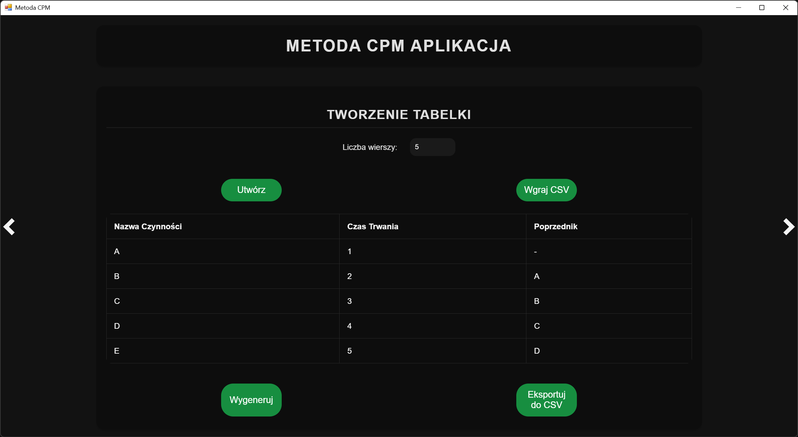
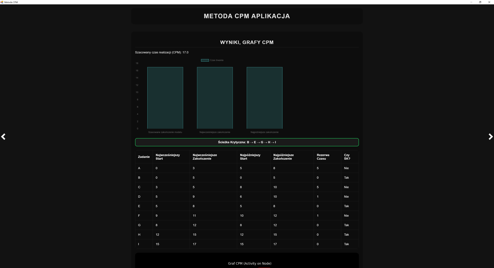
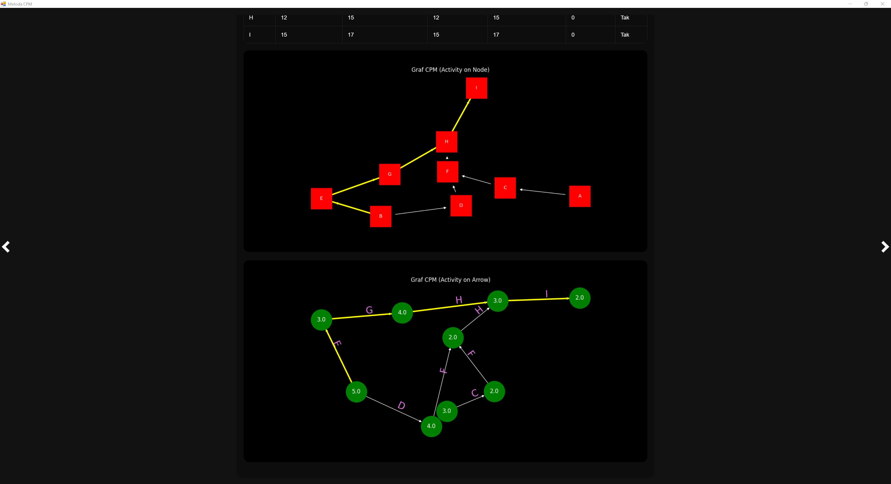
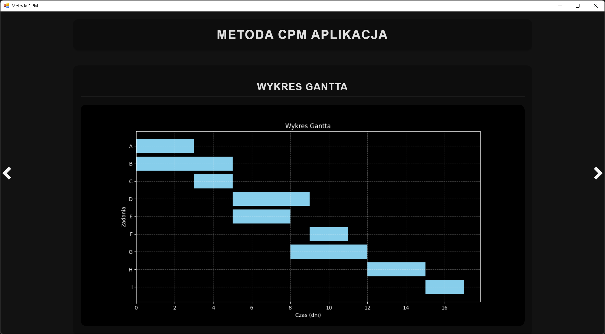

# 🇵🇱 Metoda CPM - Aplikacja

## Opis projektu

Aplikacja do zarządzania projektami wykorzystująca metodę CPM (Critical Path Method). Umożliwia tworzenie tabeli zadań, obliczanie ścieżki krytycznej, generowanie wykresów CPM oraz wykresów Gantta.

## Wymagania

- Python 3.x
- PyWebView
- Matplotlib
- NetworkX
- Chart.js

## Instalacja

1. Sklonuj repozytorium:
    ```bash
    git clone https://github.com/TwojeRepozytorium/MetodaCPM.git
    cd MetodaCPM
    ```

2. Zainstaluj wymagane biblioteki:
    ```bash
    pip install pywebview matplotlib networkx
    ```

3. Uruchom aplikację:
    ```bash
    python Main.py
    ```

## Funkcje

- Tworzenie tabeli zadań
- Importowanie i eksportowanie zadań w formacie CSV
- Obliczanie ścieżki krytycznej
- Generowanie wykresów CPM (Activity on Node i Activity on Arrow)
- Generowanie wykresów Gantta

## Zrzuty ekranu

### Tworzenie tabeli zadań


### Wyniki, Grafy CPM




### Wykres Gantta


---

# 🇺🇸 CPM Method - Application

## Project Description

A project management application using the Critical Path Method (CPM). It allows creating task tables, calculating the critical path, generating CPM charts, and Gantt charts.

## Requirements

- Python 3.x
- PyWebView
- Matplotlib
- NetworkX
- Chart.js

## Installation

1. Clone the repository:
    ```bash
    git clone https://github.com/YourRepository/CPMMethod.git
    cd CPMMethod
    ```

2. Install the required libraries:
    ```bash
    pip install pywebview matplotlib networkx
    ```

3. Run the application:
    ```bash
    python Main.py
    ```

## Features

- Creating task tables
- Importing and exporting tasks in CSV format
- Calculating the critical path
- Generating CPM charts (Activity on Node and Activity on Arrow)
- Generating Gantt charts

## Screenshots

### Creating Task Table


### Results, CPM Graphs


### Gantt Chart

